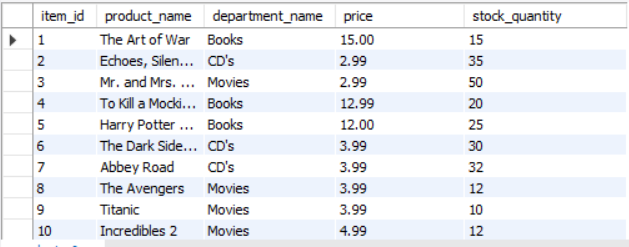
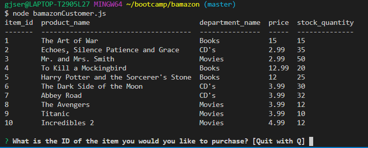
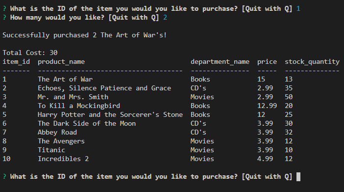
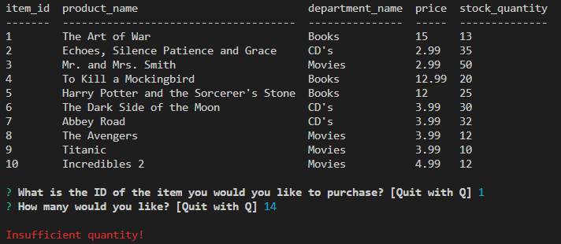

# bamazon
Bamazon is your one stop shop for Movies, CD's and Books.

The store will list the items the store carries as well as the category of the item, it's price and tthe store quantity.

The store will first prompt you for the ID of the item you would like to buy.

Then the quantity of that item you would like to buy.

Finally it will check to see if the order can be submitted.

If there is sufficient quantity the price will be rung up.

If not it will list insufficient quantity.

